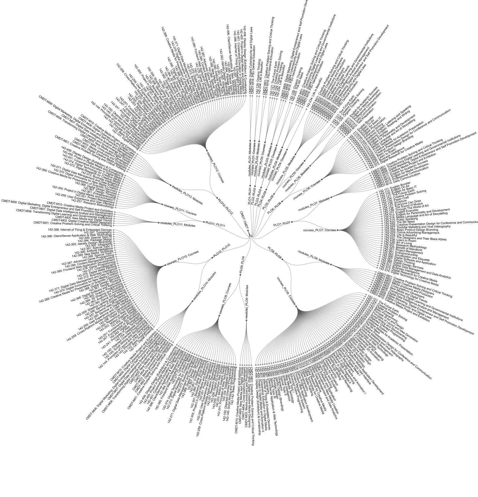
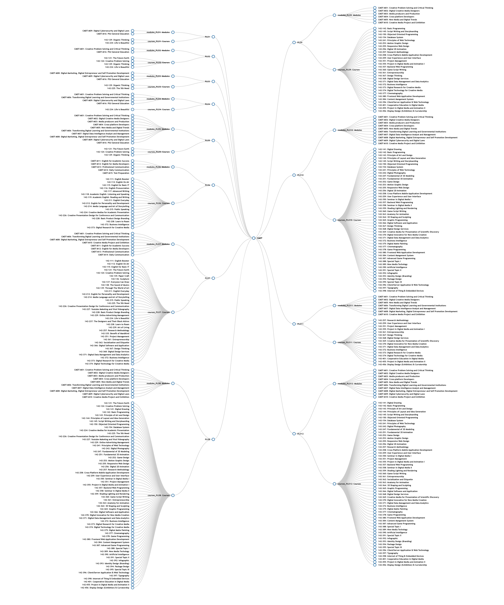

# PSUIC OBE Diagram - Curriculum CMDT 2020

This project designs to support [Curriculum CMDT 2020](https://drive.google.com/file/d/1HiBDrT6xh6pmJJ617100NXzTxjwuR4o3/view) @ PSUIC, Prince of Songkla University.






## Building and running on localhost

First install dependencies:

```sh
npm install
```

To run in hot module reloading mode:

```sh
npm start
```

To create a production build:

```sh
npm run build-prod
```

## Running

```sh
node dist/bundle.js
```

## Credits

Made with [createapp.dev](https://createapp.dev/)
